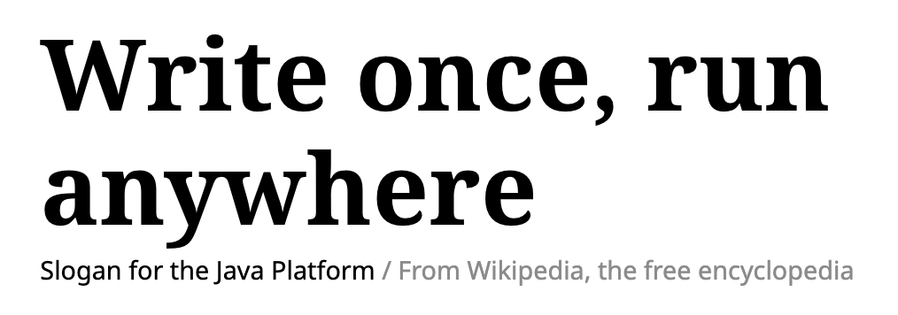
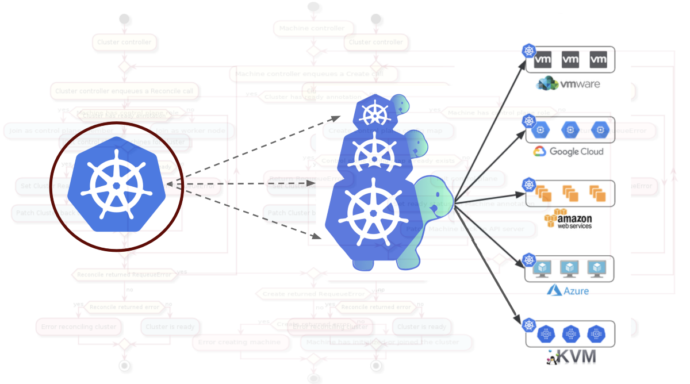
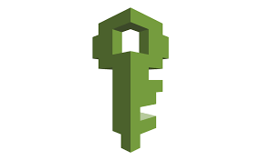
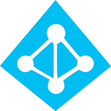
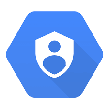
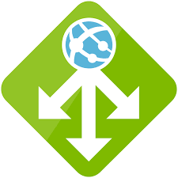
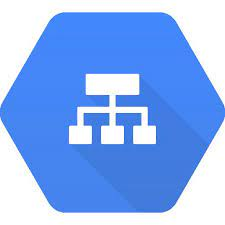
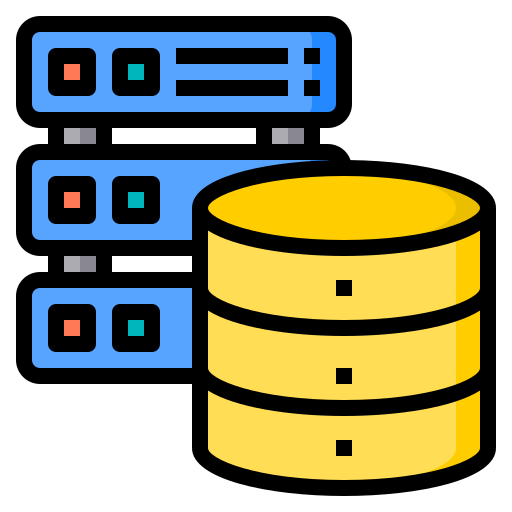
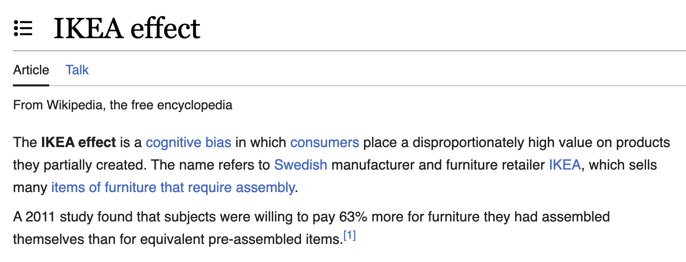

# Intro: Peter ONeill
- Sr. DevOps Consultant @ WebRiot (cloud_janitors)
- Socials: @peteroneilljr
- About Me: 
  * Rock Climbing: My favorite rocks are granite
  * Snowboarding: I'll be on Ikon this season
  * Traveling: I spent 5 years moving across 25 countries
---

# Kubernetes Portability Paradox

Balance 
- Speed (Time managing and troubleshooting)
- Flexibility (How quickly can you adapt)
- Dependencies (Do add-ons help or hinder)

<!-- Interactive, raise your hand if something is nonsense -->

---

# The promise of Kubernetes

<!-- 
Hearing this all over again
But this time for containers
photo: https://www.wikiwand.com/en/Write_once,_run_anywhere
-->

originally said in 1995 (I think), Kubernetes 2014

---

# W.O.R.A: Fiction or Reality?

Does the k8s flavor of the week cause the following?

Rewriting
Refactoring
Repositioning

<!-- https://media.licdn.com/dms/image/C4D12AQHbdeSVjE-eSw/article-inline_image-shrink_1000_1488/0/1623854065444?e=1702512000&v=beta&t=mL6IBWw4rYVUCotmlFW0Gac-hc14fqix5_rVYnVrkDg -->

---

# Agenda

1. Authentication
2. Networking
3. Compute & Memory
4. Storage
5. Service Mesh
6. Compliance and Logging

*Interactive, raise your hand if something is nonsense*

---

# Authentication
 **AWS IAM** 
 **Azure AD**
 **Google IAM** 

(Multi-cloud tools Pinnniped & Tremolo)

<!-- typically you can set this up once, and you don't think about it for a long time until you can't access something, but there are multi-cloud tools to simplify auth -->

<!-- 
Speed: Fast to get started with native tools
Flexibility: Increased with unified tools
Dependency:  Heavily dependent, locked in
-->

---

# Networking (VPC and Subnets)

- **Speed**: Let the cloud create it
- **Flexibility**: Manage the network yourself 
- **Dependency**: Complexity fosters depedency. private endpoints, service connections

---

# Networking (ALBs & Ingress) 

AWS ALB
Azure Application Gateway
Google HTTP(S) Load Balancer

<!-- 
Speed: Not fast
Flexibility: highly flexible within their cloud
Dependency: heavily dependant 
-->

---

# Ingress Controller Options

| Ingress Controller | Key Features                  | CRDs | Data Plane |
|--------------------|-------------------------------|-----------------------------|------------|
| Nginx              | SSL, Path-based routing, WebSockets | No                          | Nginx      |
| Traefik            | HTTP/2, gRPC, Let's Encrypt   | Yes                         | Traefik    |
| HAProxy            | SSL, Rate limiting            | No                          | HAProxy    |
| Kong               | API Gateway features          | Yes                         | Kong       |
| Istio Gateway      | Advanced traffic routing      | Yes                         | Envoy      |
| Contour            | HTTP/2, Let's Encrypt         | Yes                         | Envoy      |
| Ambassador         | API Gateway features          | Yes                         | Envoy      |
| Gloo               | Function-level routing        | Yes                         | Envoy      |

---

# Compute and Memory

| Cloud Provider | General Purpose | Compute Optimized | Memory Optimized | GPU Instances | Burstable/Short-lived |
|----------------|-----------------|-------------------|------------------|--------------|----------------------|
| AWS (EKS)       | m5, m6g         | c5, c6g           | r5, r6g          | p3, g4       | t3, t4g              |
| Azure (AKS)     | Ds_v3, Ds_v4    | Fs_v2             | Es_v3, Ms_v2     | NC_v3, NV_v4 | B-series             |
| Google (GKE)    | n1-standard, e2-standard | c2-standard | m2-ultramem   | n1-standard with GPUs | Preemptible Instances |

- Full parity doesn't exist
- Request and Limits are your best friends
- Know your bottle necks

<!-- 
Speed: 
Flexibility:
Dependency: 
-->

---

# Node Pools and Autoscaling

| Cloud Provider      | Autoscaling tool  | Serverless Option |
|---------------------|--------------- |--------------------|
| AWS (EKS)           | Node Groups    | Fargate Profiles   |
| Azure (AKS)         | Node Pools     | Azure Container Instances |
| Google (GKE)        | Node Pools     | GKE Autopilot      | 

** I've never tried serverless multi-cloud, if you have let me know your experience.

<!-- 
Speed: In theory serverless is better.
Flexibility: 
Dependency: I'm not sure you can choose to not use autoscaling.
-->

---

# Storage 

| Feature/Parameter       | Amazon EKS (AWS)       | Azure AKS              | Google GKE             |
|-------------------------|------------------------|------------------------|------------------------|
| **Provisioner**         | kubernetes.io/aws-ebs  | kubernetes.io/azure-disk| kubernetes.io/gce-pd  |
| **Default Volume Type** | gp2 (General Purpose)  | Standard_LRS           | pd-standard            |
| **High IOPS Option**    | io1, io2               | Premium_LRS            | pd-ssd                 |

**Storage Class Mismatch**: Use Config Maps and Environment Varibles or your Devs won't be happy.

---

# Storage (Stateless)

| Cloud Provider | Relational DB Options          | High Availability |
|----------------|------------------------------|-------------------|
| AWS (EKS)      | RDS                  | Multi-AZ          |
| Azure (AKS)    | Azure SQL  | Geo-Replication   |
| Google (GKE)   | Cloud SQL                    | Regional Replicas |
| Any  | MySQL, Postgres | * |

**Data replication is beyond the scope of this talk.

<!-- 
Speed: 
Flexibility:
Dependency: 
-->

---

# Service Mesh

| Cloud Provider      | Native Service Mesh Option | Proxy Used |
|---------------------|----------------------------|------------|
| AWS (EKS)           | AWS App Mesh               | Envoy      |
| Azure (AKS)         | Open Service Mesh          | Envoy      |
| Google (GKE)        | Istio                      | Envoy      |

Non-cloud managed

| Service Mesh  | Data Plane     | Key Features                  | Community                 |
|---------------|----------------|-------------------------------|--------------------------------|
| Linkerd       | Custom Proxy   | Load balancing, mTLS          | CNCF                   |
| Kuma          | Envoy          | Traffic routing, fault injection | Kong            |
| Maesh         | Traefik        | Traffic splitting, simplicity |  Traefik Labs       |

<!-- 
Speed: 
Flexibility:
Dependency: 
-->

---

# Compliance and Logging

| Feature/Tool                  | Amazon Web Services (AWS)  | Azure                    | Google Cloud Platform (GCP) |
|-------------------------------|----------------------------|--------------------------|-----------------------------|
| **Resource Tracking**         | AWS Config                 | Azure Policy             | Cloud Security Command Center|
| **Audit Logs**                | AWS CloudTrail             | Azure Monitor            | Cloud Audit Logs            |
| **Threat Detection**          | AWS GuardDuty              | Azure Security Center    | Cloud Security Command Center|
| **Compliance Reports**        | AWS Artifact               | Azure Compliance Manager | Access Transparency         |
| **Data Classification**       | AWS Macie                  | Azure Information Protection | Cloud Data Loss Prevention (DLP)|

---

# Compliance and Logging 

| Logging Tool       | Key Features                  | Community        | Common Integrations          |
|--------------------|-------------------------------|-----------------------|------------------------------|
| Fluentd            | Extensible, Plugin support    | CNCF           | Elasticsearch, Kibana        |
| Loki               | Optimized for Grafana         | Grafana Labs          | Grafana                      |
| Vector             | High-performance | Timber.io          | Elasticsearch, Splunk        |
| Splunk Connect     | Splunk observability          | Splunk                | Splunk                       |
| Filebeat           | Lightweight log shipper       | Elastic               | Elasticsearch, Kibana        |

**not an exhuastive list

---

# Multi-cluster tools

| Multi-Cluster Tool | Key Features                  | Community        | Cloud Support                  |
|--------------------|-------------------------------|-----------------------|--------------------------------|
| Rancher            | Centralized management, Security | Rancher       | AWS, Azure, GCP, On-premises   |
| Argo CD            | GitOps, Continuous Delivery    | CNCF                 | Any Kubernetes Cluster         |
| Anthos             | Hybrid, Centralized Management | Google Cloud         | GCP, AWS, On-premises, Azure (preview) |
| Spinnaker          | Continuous Delivery            | Netflix, Google      | AWS, Azure, GCP, Kubernetes    |
| Crossplane         | Multi-cloud Control Plane      | CNCF                 | AWS, Azure, GCP, Alibaba Cloud |

--- 

**Don't solve problems that have already been solved

---

# Things to remember

1. Don't solve problems that have already been solved
2. Look for vendor nuetral tools if you can
3. Don't make a mess of the cloud, if you do call a call a cloud janitor. (peter@webriot.com)

# Thanks for watching

<!-- 
Speed: 
Flexibility:
Dependency: 
-->
